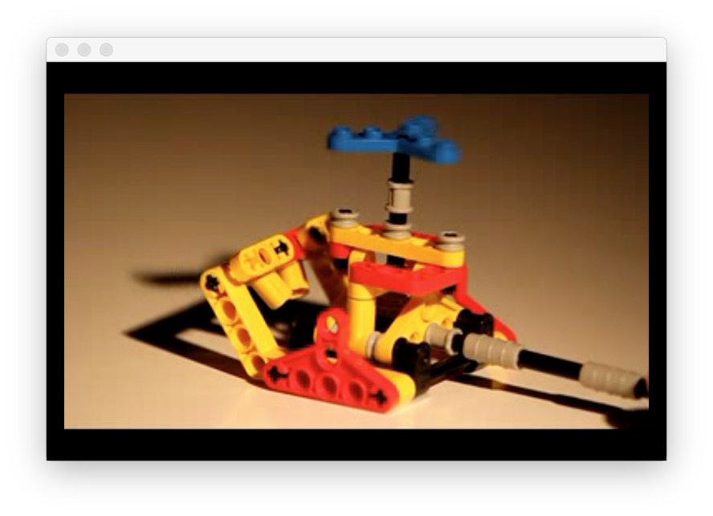

# Failamp — Simple mediaplayer build in PyQt

Simple app to listen to and watch videos and audio files, 
with built in playlist. Uses QtMultimedia and QtMultimediaWidgets
to handle playback and manage the playlist.

The main interface offers a playlist window in which you can drag-drop
media files to be played. Standard media controls are provided, along
with a timeline scrub widget and a volume control.

For video playback you can pop out an external video viewer window
which floats on top.

> If you think this app is neat and want to learn more about
PyQt in general, take a look at my [free PyQt tutorials](https://www.learnpyqt.com)
which cover everything you need to know to start building your own applications with PyQt.