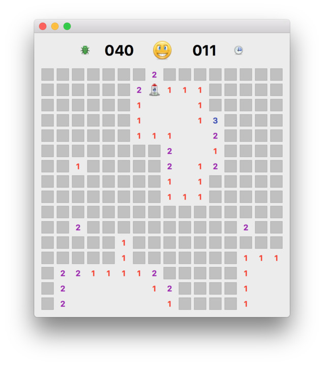
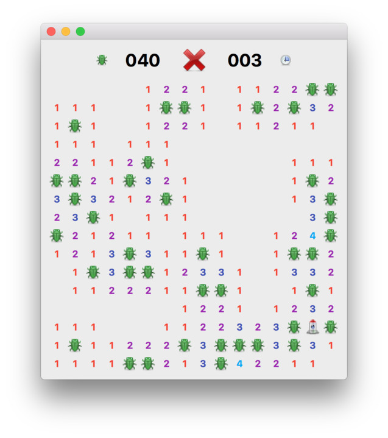

# Moonsweeper — A minesweeper clone, on a moon with aliens, in PyQt.

Explore the mysterious moon of Q'tee without getting too close to the alien natives!

Moonsweeper is a single-player puzzle video game. The objective of the game is to
explore the area around your landed space rocket, without coming too close to the
deadly B'ug aliens. Your trusty tricounter will tell you the number of B'ugs in the
vicinity.

This a simple single-player exploration game modelled on _Minesweeper_
where you must reveal all the tiles without hitting hidden mines.
This implementation uses custom `QWidget` objects for the tiles, which
individually hold their state as mines, status and the
adjacent count of mines. In this version, the mines are replaced with
alien bugs (B'ug) but they could just as easily be anything else.

> If you think this app is neat and want to learn more about
PyQt in general, take a look at my [free PyQt tutorials](https://www.learnpyqt.com)
which cover everything you need to know to start building your own applications with PyQt.

## Code notes

### Cheating the first turn

In many *Minesweeper* variants the initial turn is considered a free
go — if you hit a mine on the first click, it is moved somewhere else.
Here we cheat a little bit by taking the first go for the player, ensuring that
it is on a non-mine spot. This allows us not to worry about the bad first move
which would require us to recalculate the adjacencies.
We can explain this away as the "initial exploration around the rocket"
and make it sound completely sensible.

## Other licenses

Icons used in the application are by [Yusuke Kamiyaman](http://p.yusukekamiyamane.com/).
