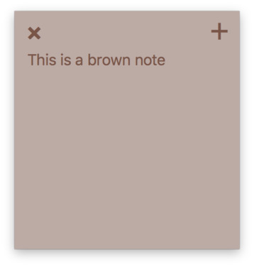

# Brown Note — A desktop Post-it note application in PyQt

Take temporary notes on your desktop, with this floating-note app. Notes
are stored locally in a SQLite database.

This app is very simple, but demonstrates creation of decoration-less windows in PyQt. Removing the window
decorations removes the means to drag windows around, so we must re-implement this behaviour ourselves.

> If you want to learn more about build GUI applications with Python,
take a look at my [PyQt5 tutorials](https://www.pythonguis.com)
which covers everything you need to know to start building your own applications with PyQt5.