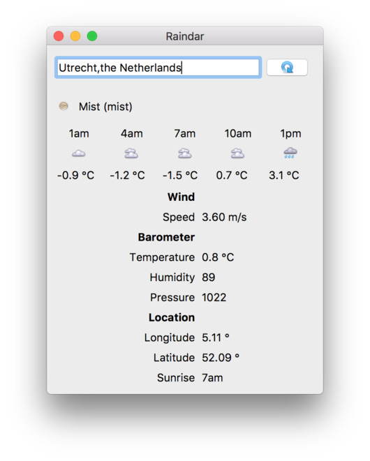

# Raindar — A weather forecase app built in PyQt

Get your daily weather and 15hr forecast. Data is provided by the free
weather and forecast API from https://openweathermap.org/

> If you think this example app is neat and want to learn more about
PyQt in general, [take a look at my ebook & online course
"Create Simple GUI Applications"](https://martinfitzpatrick.name/create-simple-gui-applications)
which covers everything you need to know to start building your own applications with PyQt.

## Other licenses

Icons used in the application are by [Yusuke Kamiyaman](http://p.yusukekamiyamane.com/).
They were renamed to match codes generated by OpenWeatherMap.
