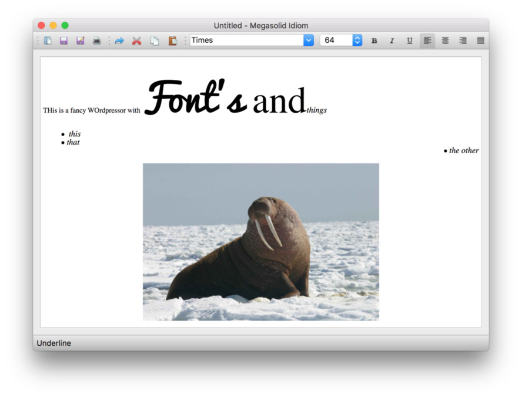

# Megasolid Idiom — A rich text editor in PyQt

The word processor for all your small, poorly formatted documents. 
An extension of the notepad, again using a QTextEdit but with rich
text editing enabled. 
 
The editor supports multiple fonts, styles and paragraph text alignment.
There is also support for drag-drop of images, which are automatically
opened and embedded.

Saves and opens HTML format documents.
 

> If you think this app is neat and want to learn more about
PyQt in general, take a look at my [free PyQt tutorials](https://www.learnpyqt.com)
which cover everything you need to know to start building your own applications with PyQt.

## Other licenses

Icons used in the application are by [Yusuke Kamiyaman](http://p.yusukekamiyamane.com/).
